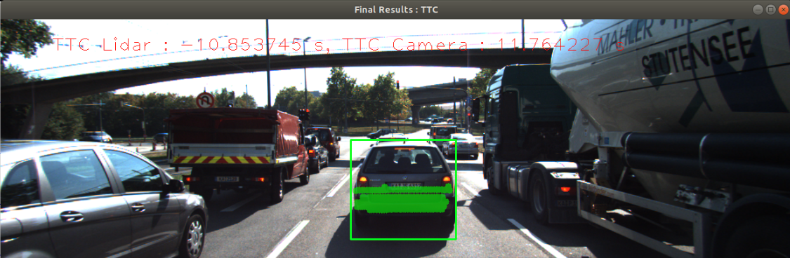

# 3D Object Tracking
Before using this repository, please download the yolov3 weights first. The link can be found in /dat/yolo/yolov3.weights.

## FP.1 Match 3D Objects
Implement the method "matchBoundingBoxes", which takes as input both the previous and the current data frames and provides as output the ids of the matched regions of interest (i.e. the boxID property). Matches must be the ones with the highest number of keypoint correspondences.
``` c++
void matchBoundingBoxes(std::vector<cv::DMatch> &matches,
                        std::map<int, int> &bbBestMatches, DataFrame &prevFrame,
                        DataFrame &currFrame) {
    std::map<std::pair<int, int>, int> matches_count;
    for (const auto &keypoint_match : matches) {
        for (int prev_bb_index = 0;
             prev_bb_index < prevFrame.boundingBoxes.size(); ++prev_bb_index) {
            if (prevFrame.boundingBoxes.at(prev_bb_index)
                    .roi.contains(
                        prevFrame.keypoints.at(keypoint_match.queryIdx).pt)) {
                for (int curr_bb_index = 0;
                     curr_bb_index < currFrame.boundingBoxes.size();
                     ++curr_bb_index) {
                    if (currFrame.boundingBoxes.at(curr_bb_index)
                            .roi.contains(
                                currFrame.keypoints.at(keypoint_match.trainIdx)
                                    .pt)) {
                        if (matches_count.find(
                                {prev_bb_index, curr_bb_index}) ==
                            matches_count.end()) {
                            matches_count.insert(
                                {{prev_bb_index, curr_bb_index}, 1});
                        } else {
                            matches_count.at({prev_bb_index, curr_bb_index}) +=
                                1;
                        }
                    }
                }
            }
        }
    }

    for (int prev_bb_index = 0; prev_bb_index < prevFrame.boundingBoxes.size();
         ++prev_bb_index) {
        std::pair<int, int> best_bb_match;
        int max_count = 0;
        for (const auto &it : matches_count) {
            if (it.first.first == prev_bb_index) {
                if (it.second > max_count) {
                    max_count = it.second;
                    best_bb_match = it.first;
                }
            }
        }

        if (max_count != 0) {
            bbBestMatches.insert({best_bb_match.first, best_bb_match.second});
        }
    }
}
```

## FP.2 Compute Lidar-based TTC
Compute the time-to-collision in second for all matched 3D objects using only Lidar measurements from the matched bounding boxes between current and previous frame.

To get more robust result, implementing a IQR rule to remove outliers.
``` c++
std::vector<LidarPoint> RemoveOutliers(
    const std::vector<LidarPoint> &lidar_points) {
    std::vector<LidarPoint> sorted_lidar_points = lidar_points;
    std::sort(
        sorted_lidar_points.begin(), sorted_lidar_points.end(),
        [&](const LidarPoint &a, const LidarPoint &b) { return a.x < b.x; });

    // 1.5 IQR rule
    int q1 = lidar_points.size() / 4;
    int q2 = lidar_points.size() / 4 * 2;
    int q3 = lidar_points.size() / 4 * 3;    
    int iqr =
        std::abs(sorted_lidar_points.at(q3).x - sorted_lidar_points.at(q1).x);

    std::vector<LidarPoint> lidar_points_without_outliers;
    for (const auto &it : sorted_lidar_points) {
        if (it.x > sorted_lidar_points.at(q1).x - 1.5 * iqr &&
            it.x < sorted_lidar_points.at(q3).x + 1.5 * iqr) {
            lidar_points_without_outliers.push_back(it);
        }
    }

    return lidar_points_without_outliers;
}

void computeTTCLidar(std::vector<LidarPoint> &lidarPointsPrev,
                     std::vector<LidarPoint> &lidarPointsCurr, double frameRate,
                     double &TTC) {
    /* remove outliers */
    std::vector<LidarPoint> prev_lidar_points_without_outliers =
        RemoveOutliers(lidarPointsPrev);
    std::vector<LidarPoint> curr_lidar_points_without_outliers =
        RemoveOutliers(lidarPointsCurr);

    // auxiliary variables
    double laneWidth = 4.0;  // assumed width of the ego lane

    // find closest distance to Lidar points within ego lane
    double minXPrev = 1e9, minXCurr = 1e9;
    for (auto it = prev_lidar_points_without_outliers.begin();
         it != prev_lidar_points_without_outliers.end(); ++it) {
        if (it->y > laneWidth / 2. || it->y < -laneWidth / 2.) {
            continue;
        }

        // std::cout << "px: " << it->x << std::endl;
        if (it->x < minXPrev) {
            minXPrev = it->x;
        }
        // minXPrev = minXPrev > it->x ? it->x : minXPrev;
    }
    for (auto it = curr_lidar_points_without_outliers.begin();
         it != curr_lidar_points_without_outliers.end(); ++it) {
        if (it->y > laneWidth / 2. || it->y < -laneWidth / 2.) {
            continue;
        }
        // std::cout << "cx: " << it->x << std::endl;
        if (it->x < minXCurr) {
            minXCurr = it->x;
        }
    }

    // compute TTC from both measurements
    TTC = minXCurr * (1. / frameRate) / (minXPrev - minXCurr);
}
```

## FP.3 Associate Keypoint Correspondences with Bounding Boxes
Prepare the TTC computation based on camera measurements by associating keypoint correspondences to the bounding boxes which enclose them. All matches which satisfy this condition must be added to a vector in the respective bounding box.
``` c++
void clusterKptMatchesWithROI(BoundingBox &boundingBox,
                              std::vector<cv::KeyPoint> &kptsPrev,
                              std::vector<cv::KeyPoint> &kptsCurr,
                              std::vector<cv::DMatch> &kptMatches) {
    std::vector<double> distances;
    for (const auto &keypoint_match : kptMatches) {
        if (boundingBox.roi.contains(kptsCurr.at(keypoint_match.trainIdx).pt)) {
            distances.push_back(
                cv::norm(kptsCurr.at(keypoint_match.trainIdx).pt -
                         kptsPrev.at(keypoint_match.queryIdx).pt));
        }
    }
    double mean_distance =
        std::accumulate(distances.begin(), distances.end(), 0.0) /
        distances.size();

    for (const auto &keypoint_match : kptMatches) {
        if (boundingBox.roi.contains(kptsCurr.at(keypoint_match.trainIdx).pt)) {
            if (cv::norm(kptsCurr.at(keypoint_match.trainIdx).pt -
                         kptsPrev.at(keypoint_match.queryIdx).pt) <
                mean_distance * 1.5) {
                boundingBox.keypoints.push_back(
                    kptsCurr.at(keypoint_match.trainIdx));
                boundingBox.kptMatches.push_back(keypoint_match);
            }
        }
    }

    std::cout << "mean value: " << mean_distance
              << "Before filtering there are: " << distances.size()
              << " and after filtering, there are "
              << boundingBox.keypoints.size() << std::endl;
}
```

## FP.4 Compute Camera-based TTC
Compute the time-to-collision in second for all matched 3D objects using only keypoint correspondences from the matched bounding boxes between current and previous frame.

``` c++
void computeTTCCamera(std::vector<cv::KeyPoint> &kptsPrev,
                      std::vector<cv::KeyPoint> &kptsCurr,
                      std::vector<cv::DMatch> kptMatches, double frameRate,
                      double &TTC, cv::Mat *visImg) {
    // compute distance ratios between all matched keypoints
    vector<double> distRatios;  // stores the distance ratios for all keypoints
                                // between curr. and prev. frame
    for (auto it1 = kptMatches.begin(); it1 != kptMatches.end() - 1;
         ++it1) {  // outer keypoint loop

        // get current keypoint and its matched partner in the prev. frame
        cv::KeyPoint kpOuterCurr = kptsCurr.at(it1->trainIdx);
        cv::KeyPoint kpOuterPrev = kptsPrev.at(it1->queryIdx);

        for (auto it2 = kptMatches.begin() + 1; it2 != kptMatches.end();
             ++it2) {  // inner keypoint loop

            double minDist = 100.0;  // min. required distance

            // get next keypoint and its matched partner in the prev. frame
            cv::KeyPoint kpInnerCurr = kptsCurr.at(it2->trainIdx);
            cv::KeyPoint kpInnerPrev = kptsPrev.at(it2->queryIdx);

            // compute distances and distance ratios
            double distCurr = cv::norm(kpOuterCurr.pt - kpInnerCurr.pt);
            double distPrev = cv::norm(kpOuterPrev.pt - kpInnerPrev.pt);

            if (distPrev > std::numeric_limits<double>::epsilon() &&
                distCurr >= minDist) {  // avoid division by zero

                double distRatio = distCurr / distPrev;
                distRatios.push_back(distRatio);
            }
        }  // eof inner loop over all matched kpts
    }      // eof outer loop over all matched kpts

    // only continue if list of distance ratios is not empty
    if (distRatios.size() == 0) {
        TTC = NAN;
        return;
    }

    std::sort(distRatios.begin(), distRatios.end());
    long medIndex = floor(distRatios.size() / 2.0);
    double medDistRatio =
        distRatios.size() % 2 == 0
            ? (distRatios[medIndex - 1] + distRatios[medIndex]) / 2.0
            : distRatios[medIndex];  // compute median dist. ratio to remove
                                     // outlier influence

    double dT = 1 / frameRate;
    TTC = -dT / (1 - medDistRatio);
}
```

## FP.5 Performance Evaluation 1
Find examples where the TTC estimate of the Lidar sensor does not seem plausible. Describe your observations and provide a sound argumentation why you think this happened.

The TTC Lidar value often exhibits significant jumps due to the detected lidar points being quite different between frames. However, after filtering out some outliers, the values stabilize and negative values are no longer present, as shown in the figure below.



## FP.6 Performance Evaluation 2
Run several detector / descriptor combinations and look at the differences in TTC estimation. Find out which methods perform best and also include several examples where camera-based TTC estimation is way off. As with Lidar, describe your observations again and also look into potential reasons.

Based on the figure below, the FAST+ORB combination appears to be highly stable for this application. Furthermore, according to the mid-term project, the computation speed of thiscombination is suitable for real-time applications as well."
|Detector+Descriptor\Frames|0-1|1-2|2-3|3-4|4-5|5-6|6-7|7-8|8-9|9-10|10-11|11-12|12-13|13-14|14-15|15-16|16-17|17-18|
|---------------|-------|-------|--------|-------|-------|-------|-------|-------|-------|--------|-------|-------|-------|-------|--------|-------|-------|-------|
|SHITOMASI+BRISK|15.7004|12.7634|13.5261|13.7589|12.8536|11.414|12.9|13.9921|12.0021|57.2153|12.7762|11.7642|11.4|12.0086|10.4171|11.4542|9.54339|9.83704|
|SHITOMASI+BRIEF|14.6756|14.4019|9.73978|14.982|12.7503|13.2703|15.2664|12.0847|11.8703|12.6285|11.8507|11.7642|11.7197|11.3557|12.1983|8.23961|11.1382|8.43097|
|SHITOMASI+ORB|13.8743|10.4802|12.8155|12.4814|12.5187|13.2198|13.0506|11.8822|11.4426|13.922|11.7805|11.5712|11.6341|10.8448|10.266|8.17853|9.68906|8.11259|
|SHITOMASI+FREAK|18.1418|13.0764|11.1634|13.5019|13.2508|14.9582|11.6087|12.6259|11.3622|13.0971|11.4072|12.7769|12.3267|12.5354|12.8936|10.7587|11.3018|10.6677|
|SHITOMASI+SIFT|14.0134|11.7823|10.9546|12.6742|11.8323|12.9945|13.4182|13.2566|12.2092|13.5138|12.1033|11.5386|11.3886|11.5744|10.8477|7.47634|11.0358|8.23276|
|HARRIS+BRISK|10.9082|11.0081|-11.4731|11.3951|44.9166|13.6217|13.497|17.6204|0.136149|-153.93|11.8135|11.6948|284.161|7.72144|-12.3391|8.52258|12.5848|0.687055|
|HARRIS+BRIEF|10.9082|63.8475|-11.4731|11.5792|35.3833|15.2483|14.2744|17.6204|3.93864|20.5862|11.1552|12.245|13.4327|5.66097|-13.6263|6.7641|12.5848|12.8381|
|HARRIS+ORB|10.9082|63.8475|-11.4731|11.5792|13.6432|13.5907|13.497|17.6204|3.93864|20.5862|11.6702|11.6948|13.4327|6.06984|-inf|6.71705|12.5848|-inf|
|HARRIS+FREAK|9.74953|-0.451554|-11.4731|12.7502|-12.7025|15.2483|13.342|36.5052|0.137835|10.2931|11.0967|12.245|13.4095|12.4394|-12.639|11.3613|11.1009|25.6763|
|HARRIS+SIFT|10.9082|-18.6701|-20.0948|11.5792|13.6432|27.8744|13.497|17.6204|-6.08749|-13.4405|11.1552|12.245|13.4327|5.66097|-13.6263|7.29175|11.7964|-inf|
|FAST+BRISK|14.3111|12.9378|16.2001|13.5094|16.7409|16.258|14.2591|14.9259|17.5909|13.7426|12.9931|12.0142|12.6742|12.4019|11.5093|11.0283|10.5156|12.5766|
|FAST+BRIEF|11.7923|11.7391|13.7671|12.8265|13.4432|13.7434|13.2657|12.3812|12.2513|12.5844|11.7538|11.3605|12.37|9.92931|11.5343|10.7137|10.3848|11.0815|
|FAST+ORB|11.3742|10.8487|12.7569|13.5673|14.3746|12.5078|13.0971|12.1086|11.8892|11.9806|11.0967|9.98629|11.5258|10.4169|10.9649|9.48037|9.19583|11.0267|
|FAST+FREAK|15.9456|10.8595|13.9403|13.7657|12.4462|12.6519|16.905|12.7284|12.9527|13.6525|12.7008|11.5556|12.6747|11.3125|11.2246|10.8114|10.398|12.2787|
|FAST+SIFT|12.3202|11.4046|13.4454|13.7535|16.3893|13.237|13.0491|13.0456|12.2554|12.1206|11.4475|11.3513|11.8572|11.1544|11.6597|9.9449|9.67378|10.7285|
|BRISK+BRISK|13.9354|15.0734|12.6231|15.4142|24.3622|15.5723|18.2141|16.7644|14.5542|14.1459|13.1319|11.4977|12.867|11.7509|12.5183|10.3576|9.4183|10.5361|
|BRISK+BRIEF|13.8215|18.0906|12.4078|21.8235|25.9018|19.1942|17.9009|18.3884|14.9617|12.0464|11.5343|14.1488|12.8926|10.3194|11.1036|12.8277|11.1959|9.5183|
|BRISK+ORB|13.9954|15.7451|13.7548|19.9631|20.6987|17.0318|19.5354|15.5633|12.5222|12.5495|13.0458|11.7085|11.64|10.7592|13.2761|10.6965|9.76526|10.6055|
|BRISK+FREAK|14.8392|24.6464|14.8765|13.9106|25.8004|13.8709|14.1516|16.8197|18.6451|13.0587|12.0719|12.6755|12.6312|11.5649|12.2787|10.0038|8.781|10.5919|
|BRISK+SIFT|15.8393|14.89|18.5535|18.1289|35.743|13.8733|16.0293|19.1502|16.3855|13.8178|12.6123|13.7791|12.9113|10.7044|13.2084|10.4902|10.5661|13.8708|
|ORB+BRISK|17.4836|15.5366|19.2234|21.3012|73.2489|12.6176|17.36|11.1|11.9786|13.3055|8.49484|5416.2|8.33753|9.26013|8.85869|9.37082|17.2956|18.6402|
|ORB+BRIEF|16.4808|16.969|30.925|25.2172|25.429|18.2578|40.0236|31.8478|70.7145|10.8526|10.4394|16.6093|10.7998|8.40597|10.5289|13.4955|18.7607|13.275|
|ORB+ORB|24.7809|10.126|18.5308|26.6829|25.2138|10.7829|36.3987|10.9114|18.651|16.6469|7.95407|30.9371|9.4542|9.5359|12.9444|9.65407|25.3838|21.8102|
|ORB+FREAK|11.9371|25.2016|17.5368|11.2797|52.139|35.7942|127.591|9.38588|13.3292|-545.044|8.40781|35.8486|7.03048|55.7876|8.72363|11.1021|-inf|24.1855|
|ORB+SIFT|17.3741|11.2445|19.2234|-inf|66.8315|20.7201|17.6169|10.8638|11.5065|11.1031|9.20223|-inf|9.72486|26.1349|24.6352|10.9804|18.7334|9.11279|
|AKAZE+BRISK|12.2899|14.7671|13.7234|14.2527|14.1246|15.0884|16.2013|14.3942|13.968|11.3987|12.7506|11.2959|10.5207|10.5446|10.0003|9.99321|9.44134|8.95291|
|AKAZE+BRIEF|13.3774|15.381|13.1413|14.5957|15.6051|13.6406|15.7392|14.4599|14.1095|11.8964|13.0259|12.1682|10.2485|10.1261|9.15073|10.1458|9.53868|8.84385|
|AKAZE+ORB|13.2771|14.5743|13.3189|14.3594|15.9471|14.146|15.8057|14.2401|13.4231|11.4075|12.329|11.6477|10.7927|10.5251|9.80301|10.2919|9.07698|8.78254|
|AKAZE+FREAK|12.773|13.9246|14.1133|13.8561|15.0307|14.2353|15.6927|14.2703|13.4975|11.878|11.9783|10.6995|10.9289|9.94007|9.19824|9.66431|9.56993|8.8873|
|AKAZE+AKAZE|12.5835|14.6579|12.949|14.6163|16.5139|13.2509|15.2119|14.5567|14.1523|11.5863|12.1869|11.5021|10.4251|10.4339|10.6541|10.0937|9.35968|9.00572|
|AKAZE+SIFT|12.6613|14.6497|13.1515|14.1718|17.0355|13.7732|15.4946|14.1466|14.1544|11.6481|12.7062|11.3908|10.9192|10.463|9.82977|10.1205|9.46144|8.84385|
|SIFT+BRISK|13.5175|12.6771|12.9017|20.794|18.2269|9.09871|15.127|13.0799|13.8644|10.2345|11.3809|10.4172|9.98468|11.0464|9.48731|9.64438|8.78329|9.67535|
|SIFT+BRIEF|11.9961|12.6771|13.9338|21.8023|14.1642|11.0631|13.1317|16.1708|12.8467|10.0891|12.0448|9.45076|9.62883|9.3534|8.74221|8.86647|8.61572|9.41223|
|SIFT+FREAK|12.1051|12.4937|13.3988|19.6967|13.5127|11.2401|14.2478|12.6864|15.0529|10.6371|11.7706|10.6537|9.33569|9.18397|9.31094|9.65444|8.68077|9.24982|
|SIFT+SIFT|11.7672|13.7536|12.646|19.0848|14.7479|12.772|14.6623|18.5753|14.679|11.0126|11.3543|11.4196|10.9092|11.8417|9.48731|9.13978|8.79561|8.91607|